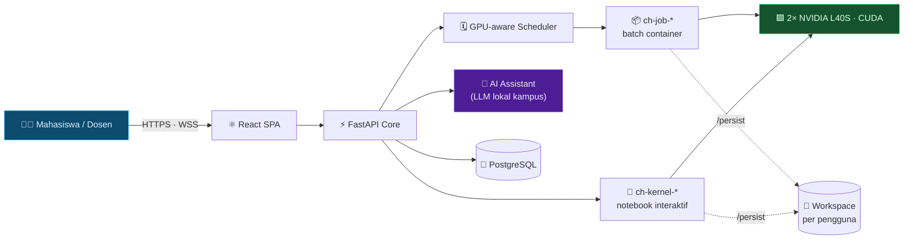
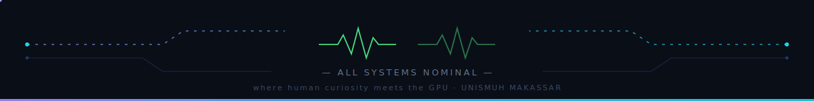

<div align="center">



<br/>


<br/><br/>


<br/>

<samp>Submit <b>kode Python · notebook · project ZIP · GitHub repo</b> —
semuanya berjalan <b>langsung di GPU</b>, terisolasi penuh per pengguna,
senyaman Google Colab. Milik kampus sendiri.</samp>

<br/><br/>


</div>

<br/>

```text
$ computehub --status
┌──────────────────────────────────────────────────────────────────────┐
│  ⬢ SCHEDULER   online    · GPU-aware queue · ETA prediction          │
│  ⬢ RUNTIME     docker    · ephemeral containers · non-root · no-net  │
│  ⬢ GPU POOL    2× NVIDIA L40S 46GB · CUDA 12.x · VRAM-aware sharing  │
│  ⬢ KERNELS     Python 3.10 │ 3.11 │ 3.12 │ 3.13 · torch + CUDA ready │
│  ⬢ AI COPILOT  local LLM  · reads YOUR errors · knows YOUR libraries │
│  ⬢ SECURITY    SSO OIDC · JWT · RLS · rate-limit · audit trail       │
└──────────────────────────────────────────────────────────────────────┘
          all systems nominal — ready to accelerate 🚀
```

## ✨ Tentang

**UNISMUH ComputeHub** adalah platform orkestrasi *job* GPU untuk server kampus
bersama — dirancang senyaman **Google Colab**, namun aman untuk banyak pengguna.
Mahasiswa & dosen menjalankan kode, melatih model, dan bereksperimen di GPU
**tanpa akses admin** — lengkap dengan pemantauan *real-time*, kuota per pengguna,
laporan penggunaan, dan isolasi penuh berbasis kontainer.

> 🎓 Digunakan internal di **Fakultas Teknik — Informatika, UNISMUH Makassar**.

## 🧠 Arsitektur



<sub>Setiap eksekusi = kontainer **efemeral** (sekali pakai, non-root, jaringan
terisolasi). Data & paket pengguna hidup di *workspace* persisten miliknya sendiri.</sub>

## 🚀 Fitur Utama

<table>
<tr>
<td width="50%" valign="top">

### 📓 Notebook Interaktif
Kernel Python **hidup di GPU** ala Colab / VS Code — dari **4 sumber**: tempel
kode, `.ipynb`, upload folder project, atau **clone GitHub repo**. Variabel
persist antar-sel, file explorer, ekspor `.ipynb`, sampai **commit & push balik
ke GitHub**.

</td>
<td width="50%" valign="top">

### 🤖 Asisten AI — sadar sistem
LLM lokal kampus yang **membaca notebook + output error asli** dan **tahu
persis library yang terpasang** di lingkunganmu — memperbaiki *traceback*,
menulis kode siap jalan, dan merekomendasikan *tool* yang memang tersedia.

</td>
</tr>
<tr>
<td width="50%" valign="top">

### 🐍 Multi-versi Python
Pilih **3.10 · 3.11 · 3.12 · 3.13** per job / per sesi notebook — semua image
berisi *stack* lengkap yang sama (PyTorch CUDA, TensorFlow, transformers,
ultralytics, +250 paket). `pip install` tersimpan per-versi di workspace-mu.

</td>
<td width="50%" valign="top">

### ⚙️ Penjadwalan GPU-aware
Antrian + **ETA prediktif** (belajar dari riwayat), *timeout* adaptif,
auto `pip install`, GPU-sharing sadar-VRAM, dan *enforcement* GPU — pekerjaan
komputasi wajib berjalan di GPU, bukan mencuri CPU server.

</td>
</tr>
<tr>
<td width="50%" valign="top">

### 🔐 Isolasi & Keamanan
Kontainer **sekali-pakai** per eksekusi: non-root, `cap-drop ALL`, jaringan
*bridge* terisolasi, *hard limit* RAM/VRAM. Login **SSO Unismuh (OIDC)** +
akun lokal (JWT), RLS di basis data, *audit log* admin.

</td>
<td width="50%" valign="top">

### 📊 Monitoring & Laporan
CPU · RAM · GPU *real-time*, laporan ala HPC (siapa memakai apa + klasifikasi
*workload* otomatis), notifikasi email saat job selesai/gagal, dan
**peringatan batas** via email + PDF.

</td>
</tr>
</table>

## 🎛️ Kebijakan Fleksibel

Kuota GPU harian · batas job paralel · plafon VRAM/RAM/CPU · kuota penyimpanan —
semuanya diatur admin **per-peran & per-pengguna** dari UI, tanpa restart.
Mode **lunak** tersedia: lewat batas → job melambat, bukan dibunuh.

## 🧩 Teknologi

| Lapisan | Teknologi |
|---|---|
| **Frontend** | React · TypeScript · Vite · Tailwind CSS · Monaco Editor |
| **Backend** | FastAPI · Python · SQLAlchemy (async) · WebSocket |
| **Komputasi** | Docker · NVIDIA CUDA · PyTorch · Jupyter kernel protocol |
| **Data** | PostgreSQL · workspace persisten per pengguna |
| **AI** | LLM lokal kampus (OpenAI-compatible) · autocomplete Jedi |
| **Auth** | SSO Unismuh (OIDC / Keycloak) · JWT · refresh cookie HttpOnly |

## 🏛️ Akses

Platform **internal kampus**. Akun dibuat oleh administrator; registrasi publik
dinonaktifkan. Login mendukung **SSO Unismuh** (akun kampus) dan akun lokal.

> 📁 Dokumentasi teknis (arsitektur, konfigurasi, *environment*, dan *deployment*)
> bersifat internal dan tidak disertakan di repositori publik ini.

<br/>

<div align="center">

### ⟢ Engineered by

## Muhammad Rizal Haris & Fatahillah Furqan Ashshidiq Yusri

`{ AI Systems Architect · GPU Infrastructure · Full-Stack Engineer }`

<br/>


<br/>

<samp>🏛️ Fakultas Teknik · 💻 Informatika · <b>UNISMUH Makassar</b></samp>

<sub>◆ © 2026 UNISMUH ComputeHub · where human curiosity meets the GPU ◆</sub>



</div>
