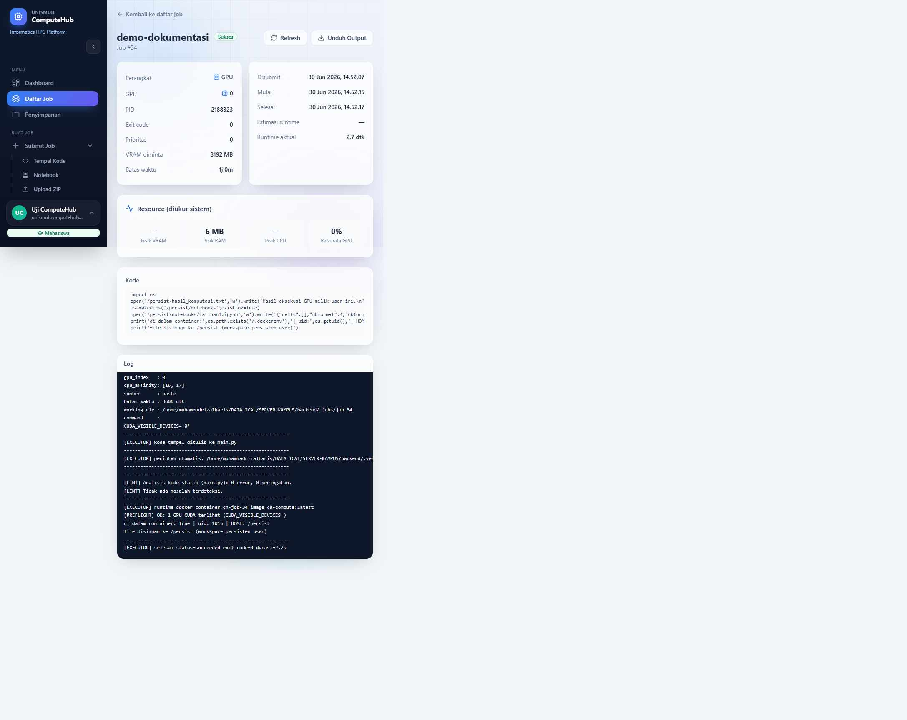
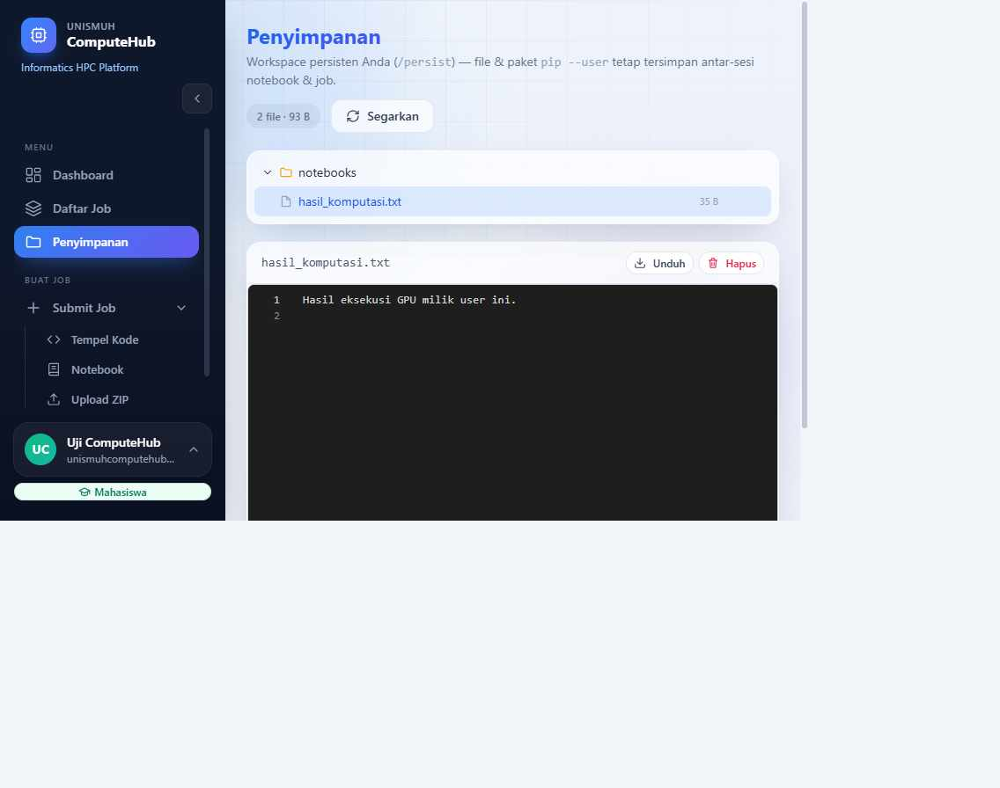

# Dokumentasi Isolasi Per‑User & Bukti — UNISMUH ComputeHub

Dokumen ini membuktikan bahwa platform sudah menerapkan **"1 user 1 docker"** dengan
lifecycle, ala Google Colab, di **server GPU bersama** — tanpa mengubah setelan sistem
(daemon/sudoers/grup) dan tanpa mengganggu container produksi pengguna lain.

- Repo: github.com/muhammadrizalharis/UNISMUH-ComputeHub
- Server: `hpc-ai` (2× NVIDIA L40S 46 GB), Docker bersama + nvidia-container-toolkit
- Tanggal pembuktian: 2026‑06‑30

---

## 1. Ringkasan model

Karena efisiensi (**mode `on_demand`**), TIDAK ada container nganggur 24 jam per user.
Isolasi "1 user 1 docker" terjadi **saat user menjalankan job/notebook**:

| Saat | Yang terjadi |
|---|---|
| User submit **job batch** | dibuat container efemeral `ch-job-<job_id>`, dihapus saat selesai (`--rm`) |
| User buka **notebook/console** | dibuat container kernel `ch-kernel-<session_id>`, dihapus saat sesi mati |
| Data user | volume durable `~/.computehub/users/<user_id>` di‑mount sebagai `/persist` |

Jadi bila tidak ada yang menjalankan apa pun, `docker ps` memang kosong — itu **normal**
(hemat resource), bukan berarti isolasi tidak aktif.

---

## 2. Lima lapis isolasi (semua AKTIF & teruji)

| # | Lapis | Mekanisme | Konfigurasi |
|---|---|---|---|
| 1 | Workspace persisten | mount `~/.computehub/users/<id>` → `/persist`, `HOME=/persist` | — |
| 2 | Isolasi jaringan | kernel di bridge (publish 5 port ZMQ ke `127.0.0.1`, bind `0.0.0.0`) | `INTERACTIVE_KERNEL_NET=bridge` (default) |
| 3 | Hardening container | `--user <uid>:<gid>` (non‑root) + `--cap-drop ALL` + `--security-opt no-new-privileges` | `DOCKER_HARDENING=true`, `DOCKER_RUN_AS_HOST_USER=true` (default) |
| 4 | Efisiensi on‑demand | tidak ada container idle; container per eksekusi | `DOCKER_PROVISION_MODE=on_demand` (default) |
| 5 | File browser "Penyimpanan" | UI melihat/unduh/hapus file `/persist` (anti‑traversal, per‑user) | endpoint `/interactive/workspace*` |

Konfigurasi live (`backend/.env`):

```
DOCKER_PROVISION_ENABLED=true
JOB_RUNTIME=docker
INTERACTIVE_RUNTIME=docker
DOCKER_USER_IMAGE=ch-compute:latest
DOCKER_CMD=/usr/bin/sudo -n /usr/bin/docker
```

(`INTERACTIVE_KERNEL_NET`, `DOCKER_PROVISION_MODE`, `DOCKER_HARDENING`,
`DOCKER_RUN_AS_HOST_USER` memakai DEFAULT aman di kode: bridge / on_demand / true / true.)

---

## 3. Bukti per lapis

### 3.1 Tahap 1 — Workspace persisten `/persist` (ala Colab Drive)

Dua job berbeda milik user yang sama berbagi `/persist`; file & `pip --user` bertahan.

```
JOB A (#29)  -> tulis /persist/hello_persist.txt + pip install --user cowsay
JOB B (#30)  -> container BERBEDA, owner sama:
   B baca file: HALO dari job A                       ← file persisten antar‑job
   B: import cowsay OK dari /persist = PERSISTEN       ← paket pip persisten
```

### 3.2 Tahap 2 — Isolasi jaringan kernel interaktif

Kernel mahasiswa TIDAK bisa mengakses layanan `localhost` server bersama. Uji
kontras (kernel nyata, headless):

| Cek | mode **bridge** (default) | mode **host** (lama, sbg pembanding) |
|---|---|---|
| akses backend host `127.0.0.1:8088` | **False** ✅ terisolasi | True (= celah yang ditutup) |
| GPU `torch.cuda` | True | True |
| `/persist` writable | True | True |

Egress tetap jalan di bridge: `dns_pypi=151.101.128.223`, `https_pypi=True`,
`pip install --user wrapt` → rc 0. Jadi internet/pip mahasiswa tidak terganggu.

### 3.3 Tahap 3 — Hardening container (hak minimal)

Job batch nyata & kernel berjalan **non‑root** dengan capability dibuang:

```
job batch #31  -> uid=1015  is_root=False  cuda=True  persist_ok=True  work_ok=True
kernel         -> uid=1015  is_root=False  host_backend_8088=False  cuda=True
```

Smoke‑test container: `--user 1015 --cap-drop ALL --security-opt no-new-privileges
--gpus device=0` → `cuda True`. File hasil dimiliki user host (bukan root) → cleanup
tanpa sudo. GPU jalan non‑root karena `/dev/nvidia*` ber‑izin `crw-rw-rw-`.

### 3.4 Tahap 4 — Efisiensi on‑demand (0 container idle)

```
mode on_demand : provision user -> folder data dibuat, container idle = False (hemat)
mode eager     : provision user -> container idle = True (opsional, kalau diperlukan)
deprovision    : container + folder terhapus, tanpa sisa
```

Hasil: untuk N user → **0 container idle** (sebelumnya N). Container hanya ada saat
dipakai.

### 3.5 Tahap 5 — File browser "Penyimpanan" (`/persist`)

Endpoint per‑user (scoped `current_user.id`, anti path‑traversal):

```
GET    /interactive/workspace            -> {tree, usage}
GET    /interactive/workspace/file       -> baca teks (≤1 MB)
PUT    /interactive/workspace/file       -> simpan (mis. notebook .ipynb)
DELETE /interactive/workspace/file       -> hapus
GET    /interactive/workspace/download   -> unduh file
```

Uji: simpan `notebooks/demo.ipynb` → tampil di pohon; unduh `hello_persist.txt` →
"HALO dari job A"; traversal `../../etc/passwd` → **400 "Path di luar workspace"**.

### 3.6 Bukti gabungan "1 USER 1 DOCKER" (demo live, Job #33 oleh user id 20)

```
docker ps SAAT job jalan:
    ch-job-33   Up 4 seconds   ch-compute:latest        ← 1 job = 1 container khusus user

log job (dari DALAM container):
    [EXECUTOR] runtime=docker container=ch-job-33 image=ch-compute:latest
    di_dalam_container(/.dockerenv): True               ← benar di dalam container
    hostname(=id container): fc14c22d7a35               ← namespace terpisah
    uid(non-root): 1015                                 ← hardening
    HOME(=volume persist user): /persist                ← volume miliknya sendiri
    isi /persist (punya user ini saja): ['.nv']         ← data terpisah per user
    bisa lihat home host?: False                        ← TIDAK bisa lihat host/user lain
    [EXECUTOR] selesai status=succeeded exit_code=0 durasi=14.8s

container ch-job-* SETELAH selesai: (kosong)            ← otomatis dihapus (--rm)
```

### 3.7 Tampilan UI (screenshot)

**Daftar Job → detail job** menampilkan log `runtime=docker container=ch-job-34`,
`di dalam container: True`, `uid: 1015`, `HOME: /persist` (Job #34, akun mahasiswa):



**Menu Penyimpanan** — file browser `/persist` per-user. File `hasil_komputasi.txt`
(hasil Job #34 di atas) tampil, bisa dibuka/diunduh/dihapus; folder internal disembunyikan:



---

## 4. Cara verifikasi mandiri (kapan saja)

Jalankan dari `~/DATA_ICAL/SERVER-KAMPUS/backend`:

```bash
# 1) Konfigurasi isolasi aktif
grep -E 'DOCKER_PROVISION_ENABLED|JOB_RUNTIME|INTERACTIVE_RUNTIME' .env

# 2) Lihat container milik user SAAT ada job/kernel berjalan
sudo -n docker ps --filter name=ch-      # ch-job-<id> / ch-kernel-<id>

# 3) Volume durable per-user (1 folder = 1 user)
ls -1 ~/.computehub/users/

# 4) Bukti isolasi di log sebuah job
grep -E 'runtime=docker|dockerenv|hostname|uid|HOME|/persist' _jobs/job_<ID>/job.log

# 5) Container produksi pengguna lain TIDAK tersentuh (hanya ch-* milik kita)
sudo -n docker ps --format '{{.Names}}'  # unismuh-*, face-annotation-* tetap utuh
```

Di UI: **Daftar Job → buka job → Log** memperlihatkan baris
`runtime=docker container=ch-job-<id>`. Menu **Penyimpanan** memperlihatkan isi
`/persist` milik user yang login.

---

## 5. Lifecycle (deprovision) — "mahasiswa lulus / dosen keluar"

| Aksi admin | Efek |
|---|---|
| Nonaktifkan user | sesi/job dihentikan; container dihapus; **volume data TETAP** (reversibel) |
| Aktifkan kembali | container dibuat lagi saat dipakai; data utuh |
| Hapus akun | purge total: user + container + volume `~/.computehub/users/<id>` |

---

## 6. Catatan keamanan & batasan jujur

- **Tidak mengubah setelan sistem**: memakai `sudo -n docker` (passwordless yang sudah
  ada), TIDAK menyentuh daemon Docker, sudoers, grup, atau iptables. Operasi container
  selalu **by‑name `ch-*`** milik kita; container produksi orang lain tak pernah disentuh.
- **Residu jaringan (diketahui)**: container bridge masih bisa menjangkau host lewat
  gateway `172.17.0.1` → layanan host yang bind `0.0.0.0` masih terjangkau. Backend kita
  bind `127.0.0.1` (loopback‑only) → **aman**. Menutup residu ini butuh firewall host
  (iptables) = perubahan sistem → sengaja TIDAK dilakukan sesuai aturan.
- **Rahasia**: `backend/.env` (SECRET_KEY, SMTP, DATABASE_URL) di‑gitignore dan
  disembunyikan dari kode user (sandbox + container terpisah dari host fs).

---

## 7. Commit terkait (jejak audit)

```
3034c98  feat(persist)  workspace persisten /persist per-user (Tahap 1)
4294381  feat(net)      isolasi jaringan kernel bridge (Tahap 2)
459486e  feat(harden)   non-root + cap-drop ALL + no-new-privileges (Tahap 3)
539edc4  perf(provision) mode on_demand (0 container idle) (Tahap 4)
19aa1fa  feat(workspace) file browser Penyimpanan (Tahap 5)
```

> Semua langkah terverifikasi live di server `hpc-ai` dan di‑push ke `origin/main`.
